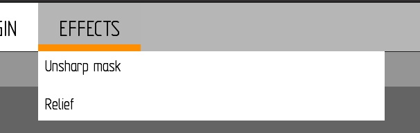

**GRAPHICAL EDITOR**
====================

This is separated repository of my graphical editor study project. The main goal of it was to get acquainted with window managers and object-oriented programming on C++.

**How to run project**
----------------------
Use terminal to type this commands:
<li>
<pre><code>make clean</code></pre> (it just makes sense :) )
</li>
<li>
<pre><code>make run</code></pre>
</li>

**How to use graphical editor**
-------------------------------
Currently graphical editor looks like this:

It has button panel and some windows with slider for tools size, canvases window and tools panel respectively.

This version of graphical editor partly supports the second version of plugins our study group worked out. That is why ikons with question marks and texts under them that you can see mean that these tools are loaded from my groupmates. Loaded effects can be seen if `EFFECTS` button will be pressed. It is the only button in project that shows drop-down menu. It is the reason it has design different from other buttons.

**Tools**
---------
I will represent the most interesting parts of working tools.
<li>
Color picker will be shown if button with color will be pressed. This button changes color to selected one. Present slider regulates transparency of color.

You cannot interact with interface when work with choosing color goes on. To leave this regime close button or `OK` button can be pressed. 

There is the example of working with color picker:
</li>

<li>
Drawing tools. All the tools work and some of them have settings windows. These tools are plugins predominantly. The windows are quite small because my colleagues have lower screen resolution, that is why I need to continue work with such results.

The example of tools using:
</li>

**Adding plugins**
------------------
New plugins can be added to project in real time. There is of instruction of how to do it:
<li>
Put plugin file into the main folder of the project. It should of `so` extension as it is a dynamic library.
</li>
<li>
Press `NEW PLUGIN` button:
</li>

<li>
Print the name of the plugin without any extensions:
</li>

<li>
Press the `OK` button.
</li>

Great! You have added new plugin. If it was tool, it will appear in the tool panel and if it was an effect you will see it if you press `EFFECTS` button. To close down-drop menu press `EFFECTS` button once more.

`relief2` is my effect plugin, which is supposed to make a relief effect on image. It has name "Relief". That is how it was added in our case:

| Before adding plugin | After adding plugin |
|:--------------------:|:-------------------:|
|  |  |

**Comments**
------------
It was planned to fully support the second plugin version but it was not realized because of lack of time. I am going to finish it when I have some free time.

**Links**
---------
There are people whose plugins I used:

- [Mark Ziganshin (loochek)](https://github.com/loochek)
- [Maxim Gorishniy (kctf)](https://github.com/Magorx)
